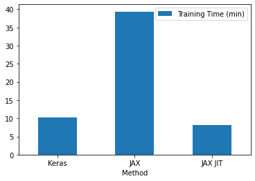
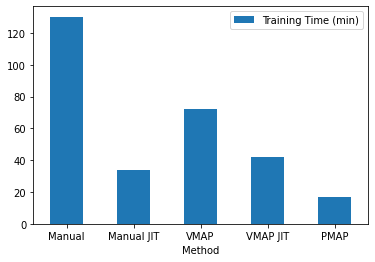
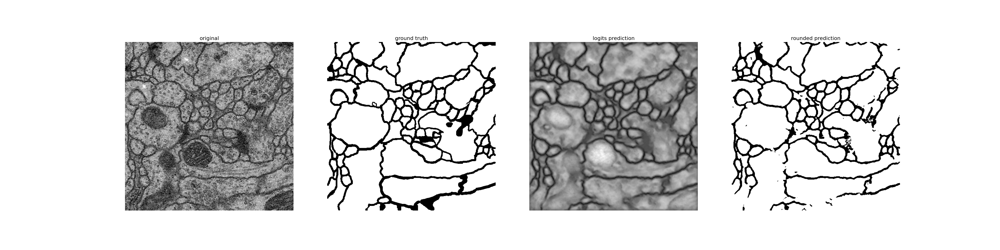

# UNET JAX

#### Implementation of the UNET convolutional network using JAX, FLAX and OPTAX

#### Each branch is a different implementation of the training loop, so that they can be easily compared

#### Dataset: [isbi2012](https://github.com/alexklibisz/isbi-2012)

#### Keras code used for comparison: [keras-unet](https://github.com/karolzak/keras-unet)

To run, execute `python unet_jax/train_unet.py`

### Branches with support for batch size = N (mini-batch)

* unet_jax
* unet_jax_jit
* unet_vamp
* unet_vmap_jit
* unet_pmap

### Branches with support for batch size=1 (SGD)

* unet_jax_batchsize1
* unet_jit_batchsize1

### SGD performance comparison

### Mini-batch gradient descent performance comparison

### Segmentation Result 
### From left to right: original image; target; logits; final prediction

